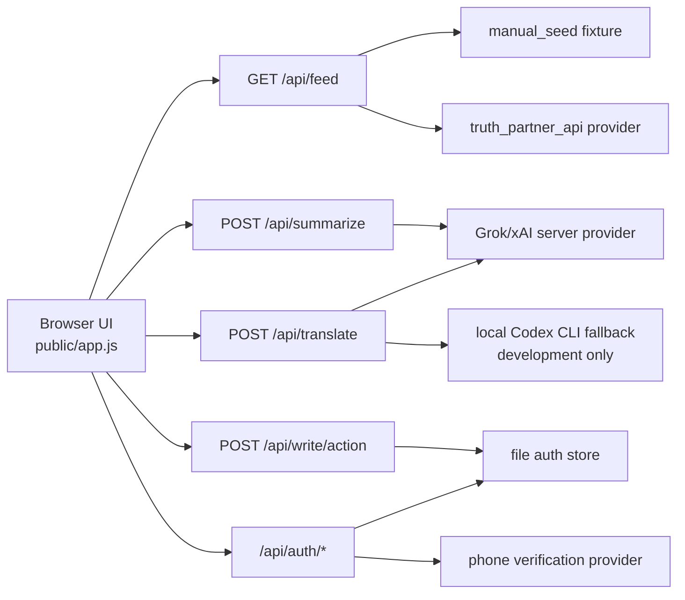

# Architecture

Truth World is a static-first reader with a small server-side provider boundary.
The browser renders the product surface and calls only local API routes. Provider
credentials, partner feed access, translation calls, and write eligibility
checks stay on the Node server.

## Runtime shape

## Boundaries

- Browser code must not contain provider secrets or direct xAI/Truth Social API calls.
- Feed ingestion uses `manual_seed` until an approved partner API is configured.
- Translation and summarization run through server endpoints only.
- Reading is public. Writing-like actions require a signed-in account with verified
  phone and country, enforced server-side.
- The project intentionally avoids scrapers, crawlers, browser automation
  collectors, and unofficial Truth Social extraction.

## Current module map

- `server.js` owns HTTP routing, static serving, quotas, and provider selection.
- `src/grok.js` owns Grok/xAI message construction, JSON parsing, and payload normalization.
- `src/codex-cli.js` owns local development translation fallback through `codex exec`.
- `src/truth-partner.js` owns approved partner feed normalization and network policy.
- `src/auth-store.js` owns local file-backed authentication and session storage.
- `src/phone-verification.js` owns phone verification provider adapters.
- `src/security-policy.js`, `src/url-policy.js`, and `src/rate-limit.js` own hardening helpers.
- `public/app.js` owns static UI state, rendering, language packs, and client API calls.

## Planned extension points

The next structural step is to split the current one-file server into route
modules and to add an explicit `copilot` provider interface. Until that exists,
the public repository should treat the right-side copilot as a UI/local-context
assistant surface, not as a mature object-aware AI contract.

